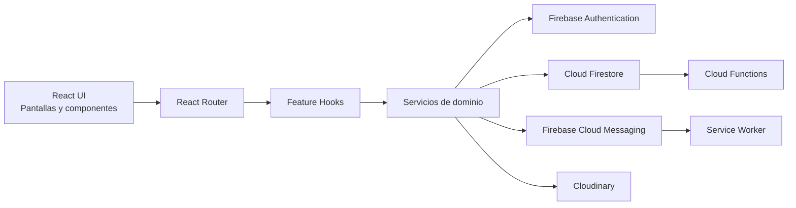

# SplitFlow

<p align="center">
  <strong>Plataforma web para la gestion colaborativa de gastos, saldos y pagos entre personas y grupos.</strong>
</p>

<p align="center">
  
  
  
  
  
  
</p>

---

## Resumen

**SplitFlow** es una aplicacion web de tipo SPA orientada a la administracion de gastos compartidos. El sistema permite registrar usuarios, crear grupos, agregar amigos, distribuir gastos entre participantes, consolidar balances netos y documentar pagos manuales para reducir deudas pendientes.

Desde una perspectiva funcional, el proyecto ataca un problema cotidiano y recurrente: la falta de trazabilidad cuando varias personas comparten consumos, adelantan pagos o liquidan saldos en distintos momentos. Desde una perspectiva tecnica, el repositorio implementa una arquitectura moderna sobre **React + TypeScript + Firebase**, con separacion clara entre interfaz, logica de negocio, acceso a datos, validaciones y servicios auxiliares.

> Este repositorio corresponde a un proyecto academico con enfoque aplicado en construccion de software, modelado de dominio y desarrollo full stack serverless.

---

## Tabla de contenido

1. [Vision general](#vision-general)
2. [Problema y objetivos](#problema-y-objetivos)
3. [Alcance funcional](#alcance-funcional)
4. [Arquitectura del sistema](#arquitectura-del-sistema)
5. [Stack tecnologico](#stack-tecnologico)
6. [Modelo de datos](#modelo-de-datos)
7. [Reglas de negocio y calculo](#reglas-de-negocio-y-calculo)
8. [Rutas principales](#rutas-principales)
9. [Estructura del proyecto](#estructura-del-proyecto)
10. [Instalacion y puesta en marcha](#instalacion-y-puesta-en-marcha)
11. [Configuracion del entorno](#configuracion-del-entorno)
12. [Notificaciones push y funciones cloud](#notificaciones-push-y-funciones-cloud)
13. [Scripts disponibles](#scripts-disponibles)
14. [Consideraciones de calidad, seguridad y despliegue](#consideraciones-de-calidad-seguridad-y-despliegue)
15. [Limitaciones actuales](#limitaciones-actuales)
16. [Hoja de ruta](#hoja-de-ruta)
17. [Contexto academico](#contexto-academico)

---

## Vision general

SplitFlow organiza el flujo de una deuda compartida en cinco etapas:

1. Un usuario crea su cuenta o inicia sesion.
2. El usuario establece relaciones con otras personas mediante solicitudes de amistad.
3. Se crean grupos de gasto con miembros definidos.
4. Se registran gastos con reparto equitativo o personalizado.
5. El sistema calcula saldos netos y permite registrar pagos manuales para liquidarlos.

El resultado es una experiencia enfocada en responder con claridad tres preguntas centrales:

- `Quien pago`
- `Cuanto corresponde a cada participante`
- `Quien aun debe dinero y cuanto`

Tambien incorpora capacidades complementarias de alto valor practico:

- perfil editable con moneda por defecto, contacto y fotografia
- notificaciones push para solicitudes de amistad
- panel de balances con historial de pagos manuales
- trazabilidad basica de eventos mediante registros de actividad

> Nota: en `package.json` el nombre tecnico del paquete raiz aun figura como `untitled`, pero la identidad funcional y visual del sistema es **SplitFlow**.

---

## Problema y objetivos

### Problema

Cuando varias personas comparten gastos, la informacion suele dispersarse entre mensajes, capturas, notas informales o memoria individual. Eso genera:

- errores en los montos adeudados
- discusiones por falta de evidencia
- dificultad para saber quien debe a quien
- poca trazabilidad de pagos ya realizados

### Objetivo general

Disenar e implementar una aplicacion web que centralice la gestion de gastos compartidos y permita visualizar balances pendientes de forma consistente, comprensible y auditable.

### Objetivos especificos

- modelar usuarios, grupos, gastos, amistades y settlements como entidades de dominio
- automatizar el calculo de balances netos por grupo y por usuario
- permitir diferentes estrategias de reparto de gastos
- registrar pagos manuales sin depender de un sistema externo de cobro
- mejorar la experiencia del usuario mediante autenticacion, proteccion de rutas y notificaciones

---

## Alcance funcional

### Funcionalidades implementadas

| Modulo | Capacidades incluidas |
| --- | --- |
| Autenticacion | Registro con correo, inicio de sesion con correo, inicio de sesion con Google, recuperacion de contrasena, persistencia local de sesion |
| Perfil | Edicion de nombre visible, moneda por defecto, telefono, ubicacion, biografia y foto de perfil |
| Amigos | Envio de solicitudes, aceptacion de solicitudes pendientes, eliminacion de relacion y consulta de amistades |
| Grupos | Creacion de grupos, consulta de grupos del usuario y detalle de miembros |
| Gastos | Registro de gastos, detalle individual del gasto, reparto igual o personalizado, eliminacion del gasto por flujo existente |
| Balances | Calculo de cuanto te deben, cuanto debes, simplificacion de transferencias y vista consolidada por contraparte |
| Settlements | Registro manual de pagos enviados a otro usuario, con fecha, monto, nota y contexto opcional de grupo |
| Notificaciones | Notificaciones push web para solicitudes de amistad mediante Firebase Cloud Messaging |
| Actividad | Registro de eventos de dominio para ciertas operaciones relevantes |

### Casos de uso destacados

- dividir la cuenta de una salida entre varios amigos
- administrar gastos de un viaje grupal
- registrar pagos posteriores para reducir saldos
- visualizar rapidamente el estado financiero personal dentro de la aplicacion

---

## Arquitectura del sistema

La aplicacion adopta una organizacion por capas con separacion entre:

- interfaz y rutas
- hooks de consumo
- servicios de dominio y acceso a Firebase
- validaciones con Zod
- utilidades de calculo
- tipos de dominio

### Vista arquitectonica



### Caracteristicas tecnicas de la arquitectura

- **SPA con React 19**: la aplicacion renderiza una sola interfaz cliente y navega mediante `react-router-dom`.
- **Carga diferida de pantallas**: las rutas principales se cargan con `lazy` y `Suspense`.
- **Proveedor global de autenticacion**: `AuthProvider` centraliza el estado de sesion y el perfil del usuario.
- **Capa de servicios por feature**: cada modulo (`auth`, `groups`, `expenses`, `friends`, `settlements`, `users`, `notifications`) encapsula su acceso a datos.
- **Validacion declarativa**: los formularios usan `react-hook-form` y `zod`.
- **Backend serverless**: la persistencia y automatizacion se apoyan en Firebase y Cloud Functions sin un servidor tradicional dedicado.

---

## Stack tecnologico

### Frontend

- React 19
- TypeScript
- Vite
- React Router DOM
- Tailwind CSS
- React Hook Form
- Zod

### Backend y servicios gestionados

- Firebase Authentication
- Cloud Firestore
- Firebase Cloud Messaging
- Cloud Functions for Firebase
- Firebase Storage (infraestructura disponible en el proyecto)
- Cloudinary para imagenes de perfil

### Calidad y herramientas

- ESLint
- TypeScript Compiler
- PostCSS

---

## Modelo de datos

El sistema utiliza documentos en Firestore y subcolecciones para algunos casos particulares.

### Colecciones principales

| Coleccion | Proposito | Campos principales |
| --- | --- | --- |
| `users` | Perfil de usuario | `uid`, `email`, `displayName`, `photoURL`, `phoneNumber`, `location`, `bio`, `currency` |
| `groups` | Espacios de gasto compartido | `name`, `description`, `createdBy`, `memberIds`, `admins` |
| `expenses` | Gastos registrados | `groupId`, `description`, `amount`, `currency`, `date`, `paidBy`, `participantIds`, `splitType`, `splits` |
| `settlements` | Pagos manuales entre usuarios | `groupId`, `fromUserId`, `toUserId`, `amount`, `currency`, `date`, `note` |
| `friendships` | Relaciones y solicitudes | `requesterId`, `addresseeId`, `status` |
| `activityLogs` | Registro de actividad | `entityType`, `entityId`, `groupId`, `action`, `actorUid`, `meta` |
| `users/{userId}/notificationTokens` | Tokens FCM por navegador | `token`, `platform`, `userAgent`, `updatedAt` |

### Entidades clave del dominio

#### Expense

Un gasto contiene:

- descripcion del consumo
- monto y moneda
- fecha
- pagador
- lista de participantes
- estrategia de reparto (`equal` o `custom`)
- lista de `splits` por usuario

#### Settlement

Un settlement representa un pago manual registrado dentro de la app. No procesa dinero real; solo documenta que una persona pago a otra cierta cantidad para reducir una deuda.

#### Friendship

La amistad funciona con dos estados actualmente:

- `pending`
- `accepted`

### Observaciones de modelado

- los montos se redondean a dos decimales para reducir inconsistencias
- los balances se calculan a partir de gastos y settlements, no se almacenan como valores derivados persistentes
- la moneda del perfil del usuario define la moneda de visualizacion y conversion de saldos

---

## Reglas de negocio y calculo

La logica de negocio del proyecto no se limita a almacenar formularios; tambien aplica reglas de consistencia importantes.

### Validaciones de gastos

- la descripcion debe existir
- el monto debe ser mayor a `0`
- la fecha es obligatoria
- el pagador debe estar incluido entre los participantes
- debe existir al menos un participante
- cada participante debe tener un split valido
- la suma de los splits debe coincidir con el monto total con tolerancia de `+/- 0.01`

### Estrategias de reparto

- `equal`: distribuye el monto de forma equitativa y reparte residuos en centavos entre los primeros usuarios
- `custom`: permite ingresar manualmente la participacion monetaria de cada integrante

### Calculo de balances

La aplicacion:

1. acredita al pagador el monto total del gasto
2. debita a cada participante la parte correspondiente
3. aplica settlements para reducir deuda y credito
4. simplifica el resultado neto a transferencias del tipo `X debe a Y`

### Conversor de moneda

Actualmente la logica soporta principalmente:

- `DOP`
- `USD`

La conversion interna utiliza una tasa fija definida en codigo:

- `1 USD = 60 DOP`

Esto simplifica el calculo, pero tambien implica una limitacion importante: no existe aun integracion con tasas de cambio en tiempo real.

---

## Rutas principales

| Ruta | Tipo | Descripcion |
| --- | --- | --- |
| `/login` | Publica | Acceso de usuarios registrados |
| `/register` | Publica | Registro de nuevos usuarios |
| `/forgot-password` | Publica | Solicitud de recuperacion de contrasena |
| `/dashboard` | Privada | Resumen general del estado del usuario |
| `/groups` | Privada | Lista de grupos del usuario |
| `/groups/new` | Privada | Creacion de un grupo |
| `/groups/:groupId` | Privada | Vista de detalle de un grupo |
| `/groups/:groupId/expenses/new` | Privada | Registro de gasto dentro de un grupo |
| `/expenses/:expenseId` | Privada | Detalle individual de un gasto |
| `/friends` | Privada | Gestion de amistades y solicitudes |
| `/balances` | Privada | Consulta de saldos y pagos manuales |
| `/settle-up` | Privada | Registro de pagos manuales |
| `/profile` | Privada | Configuracion del perfil del usuario |

---

## Estructura del proyecto

```text
.
|-- functions/                  # Cloud Functions para automatizaciones backend
|   |-- index.js
|   `-- package.json
|-- public/
|-- src/
|   |-- app/
|   |   |-- providers/         # Contextos globales y proveedor de autenticacion
|   |   `-- router/            # Definicion de rutas, proteccion y layout
|   |-- components/            # Pantallas y componentes visuales principales
|   |-- features/
|   |   |-- activity/          # Registro de actividad
|   |   |-- auth/              # Login, registro y sesion
|   |   |-- expenses/          # Gastos y consultas asociadas
|   |   |-- friends/           # Solicitudes y relaciones de amistad
|   |   |-- groups/            # Grupos y membresias
|   |   |-- notifications/     # Push notifications
|   |   |-- settlements/       # Pagos manuales
|   |   `-- users/             # Perfil y servicios de usuario
|   |-- lib/
|   |   |-- firebase/          # Configuracion de Firebase y helpers
|   |   |-- utils/             # Calculos, navegacion y utilidades generales
|   |   `-- validations/       # Esquemas Zod
|   |-- types/                 # Tipos de dominio
|   |-- App.tsx
|   |-- main.tsx
|   `-- firebase-messaging-sw.ts
|-- firebase.json
|-- firestore.rules
|-- firestore.indexes.json
|-- storage.rules
|-- tailwind.config.js
|-- tsconfig.json
`-- vite.config.ts
```

### Patron de organizacion

La estructura sigue un enfoque **feature-oriented**, adecuado para proyectos medianos donde la logica de cada dominio necesita crecer sin mezclar UI, datos y validaciones en un mismo lugar.

---

## Instalacion y puesta en marcha

### Requisitos previos

Se recomienda trabajar con:

- Node.js `20.x`
- npm `10+`
- Firebase CLI instalada globalmente si se va a desplegar infraestructura
- un proyecto Firebase previamente creado

### Instalacion del frontend

```bash
npm install
```

### Instalacion de Cloud Functions

```bash
cd functions
npm install
cd ..
```

### Ejecucion en desarrollo

```bash
npm run dev
```

La aplicacion quedara disponible en el servidor local configurado por Vite.

---

## Configuracion del entorno

### Variables del frontend

Crea un archivo `.env` en la raiz del proyecto a partir de `.env.example`.

```env
VITE_FIREBASE_API_KEY=tu_api_key
VITE_FIREBASE_AUTH_DOMAIN=tu_auth_domain.firebaseapp.com
VITE_FIREBASE_PROJECT_ID=tu_project_id
VITE_FIREBASE_STORAGE_BUCKET=tu_project_id.appspot.com
VITE_FIREBASE_MESSAGING_SENDER_ID=000000000000
VITE_FIREBASE_APP_ID=1:000000000000:web:xxxxxxxxxxxxxxxxxxxxxx
VITE_FIREBASE_MEASUREMENT_ID=G-XXXXXXXXXX
VITE_FIREBASE_VAPID_KEY=tu_clave_publica_vapid
VITE_CLOUDINARY_CLOUD_NAME=tu_cloud_name
VITE_CLOUDINARY_UPLOAD_PRESET=tu_unsigned_upload_preset
```

### Descripcion de variables

| Variable | Obligatoria | Uso |
| --- | --- | --- |
| `VITE_FIREBASE_API_KEY` | Si | Conexion con Firebase |
| `VITE_FIREBASE_AUTH_DOMAIN` | Si | Dominio de autenticacion |
| `VITE_FIREBASE_PROJECT_ID` | Si | Proyecto base de Firestore y Messaging |
| `VITE_FIREBASE_STORAGE_BUCKET` | Si | Bucket configurado para Firebase |
| `VITE_FIREBASE_MESSAGING_SENDER_ID` | Si | Integracion con Cloud Messaging |
| `VITE_FIREBASE_APP_ID` | Si | Identificador de la app web |
| `VITE_FIREBASE_MEASUREMENT_ID` | No | Telemetria si se usa Analytics |
| `VITE_FIREBASE_VAPID_KEY` | Si, si usaras push | Registro del navegador para notificaciones web |
| `VITE_CLOUDINARY_CLOUD_NAME` | Si, si usaras fotos | Cloud name de Cloudinary |
| `VITE_CLOUDINARY_UPLOAD_PRESET` | Si, si usaras fotos | Upload preset unsigned para fotos de perfil |

### Variables de Cloud Functions

Si deseas personalizar la URL absoluta usada por las notificaciones, configura en el entorno de funciones:

```env
APP_BASE_URL=https://tu-dominio-o-hosting.web.app
```

Si no se define, la funcion intenta construir la URL usando `https://<projectId>.web.app`.

### Configuracion de Cloudinary

Para el flujo actual de foto de perfil se recomienda:

- preset unsigned
- carpeta dedicada, por ejemplo `splitflow/profile-images`
- formatos permitidos `jpg`, `png`, `webp`
- tamano maximo de `2 MB`

> Aunque el proyecto incluye configuracion de Firebase Storage, las fotos de perfil que hoy consume la interfaz se almacenan en Cloudinary y luego se guarda solo la URL en el perfil del usuario.

---

## Notificaciones push y funciones cloud

El proyecto integra un flujo completo de notificaciones para solicitudes de amistad.

### Flujo resumido

1. Un usuario envia una solicitud de amistad.
2. Se crea un documento en `friendships`.
3. Una Cloud Function detecta la creacion del documento.
4. La funcion obtiene los tokens registrados del destinatario.
5. Firebase Cloud Messaging envia la notificacion.
6. El service worker muestra la notificacion y redirige a `/friends` al hacer clic.

### Funcion implementada

- `sendFriendRequestNotification`

### Requisitos para que funcione correctamente

- Firebase Cloud Messaging habilitado
- clave `VITE_FIREBASE_VAPID_KEY` valida y asociada al mismo proyecto Firebase
- navegador compatible con Push API
- entorno seguro (`https` o localhost)
- permisos de notificacion concedidos por el usuario

### Despliegue de funciones

```bash
cd functions
npm install
cd ..
firebase deploy --only functions
```

### Reglas e indices

El repositorio ya incluye:

- `firestore.rules`
- `firestore.indexes.json`
- `storage.rules`
- `firebase.json`

Para publicar reglas actualizadas:

```bash
firebase deploy --only firestore:rules
```

---

## Scripts disponibles

| Script | Descripcion |
| --- | --- |
| `npm run dev` | Ejecuta el entorno de desarrollo con Vite |
| `npm run build` | Compila TypeScript y genera el build de produccion |
| `npm run lint` | Ejecuta analisis estatico con ESLint |
| `npm run preview` | Sirve localmente el build generado |

### Flujo recomendado de verificacion local

```bash
npm run lint
npm run build
```

---

## Consideraciones de calidad, seguridad y despliegue

### Calidad de codigo

- el proyecto usa TypeScript para modelado explicito del dominio
- la validacion de formularios se realiza con `Zod`
- la estructura modular facilita mantenimiento y escalabilidad
- la separacion entre hooks y servicios reduce acoplamiento en la UI

### Seguridad

- las rutas privadas estan protegidas con `ProtectedRoute`
- Firestore se apoya en reglas de seguridad definidas en `firestore.rules`
- los tokens push se guardan por usuario y navegador
- las imagenes de perfil se validan por tipo y tamano antes de subirlas

### Despliegue

El repositorio ya contempla configuracion de Firestore y Functions. Si se desea un despliegue completo de la SPA con Firebase Hosting, conviene completar o extender la seccion `hosting` en `firebase.json` segun el entorno objetivo.

---

## Limitaciones actuales

Como todo proyecto academico en evolucion, SplitFlow aun presenta oportunidades claras de maduracion:

- no hay una suite automatizada de pruebas unitarias o de integracion
- la conversion de moneda usa una tasa fija, no una fuente en tiempo real
- el flujo principal cubre pagos manuales, no pagos reales procesados por una pasarela
- Firebase Hosting no aparece completamente configurado en `firebase.json`
- algunas capacidades de infraestructura existen en el codigo, pero aun no estan explotadas en toda la interfaz

---

## Hoja de ruta

Las siguientes mejoras tienen alto valor tecnico y funcional:

- edicion y anulacion completa de settlements
- filtros por fecha, grupo, usuario y estado de deuda
- historial visual de actividad dentro de la interfaz
- pruebas unitarias para calculos y validaciones
- pruebas end-to-end para flujos criticos
- soporte multimoneda con tasas dinamicas
- dashboards analiticos por grupo
- despliegue integral documentado con Firebase Hosting

---

## Contexto academico

SplitFlow puede leerse como un ejercicio integral de ingenieria de software porque combina:

- modelado de entidades y relaciones
- validacion de reglas de negocio
- diseno de interfaz centrado en tareas reales
- integracion con servicios cloud
- automatizacion serverless basada en eventos

En ese sentido, el proyecto no solo resuelve un caso practico de division de gastos, sino que tambien sirve como evidencia de competencias en:

- desarrollo frontend moderno
- persistencia NoSQL
- autenticacion y control de acceso
- integracion con APIs y servicios externos
- organizacion modular de codigo

---

## Cierre

**SplitFlow** es una base solida para seguir evolucionando una solucion de gastos compartidos con enfoque realista, mantenible y escalable. Su principal fortaleza no es unicamente la interfaz, sino la combinacion de:

- un dominio bien definido
- reglas de negocio explicitadas en codigo
- arquitectura modular
- uso coherente de Firebase como backend serverless

Si el objetivo es presentar el proyecto en un contexto academico, tecnico o de portafolio, este repositorio ya ofrece una narrativa clara: un producto funcional, con modelo de negocio comprensible, decisiones de arquitectura justificables y margen razonable para iteraciones futuras.
